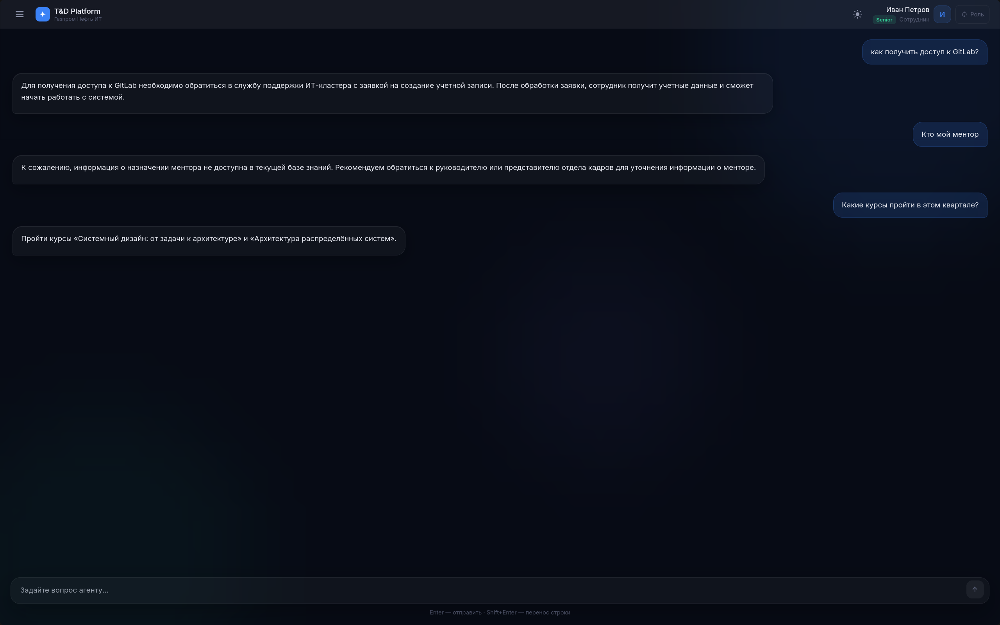
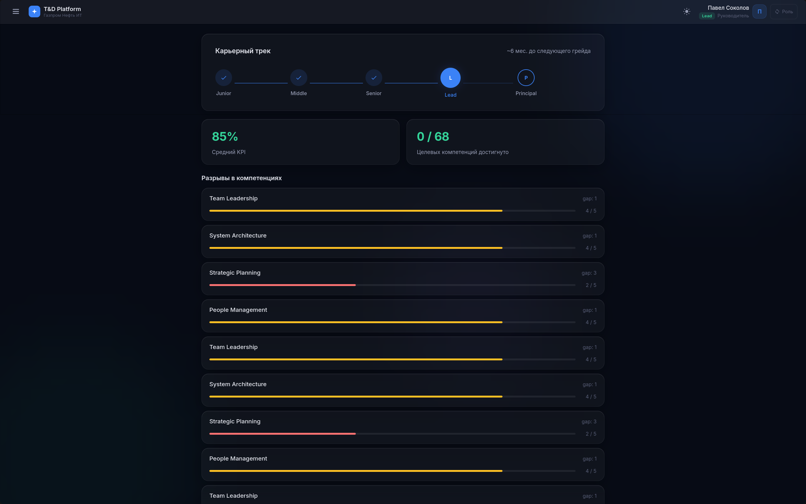
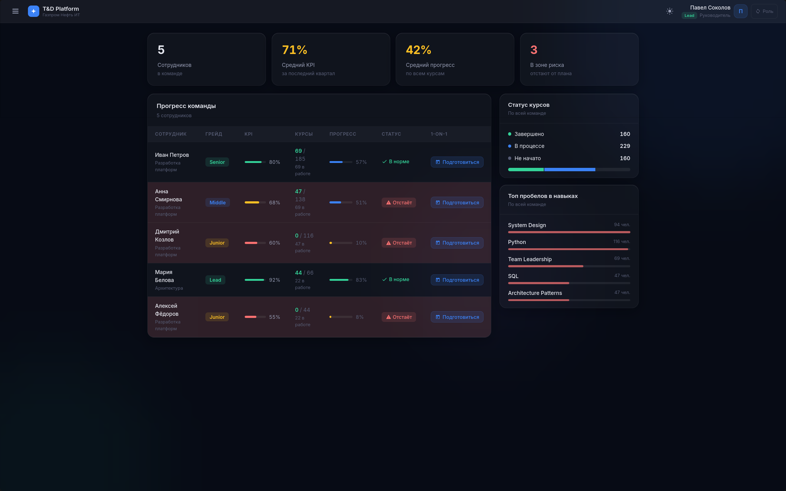
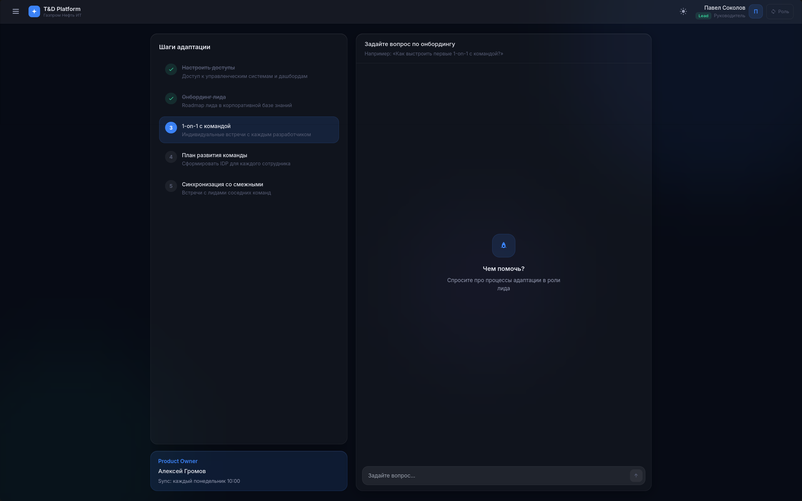
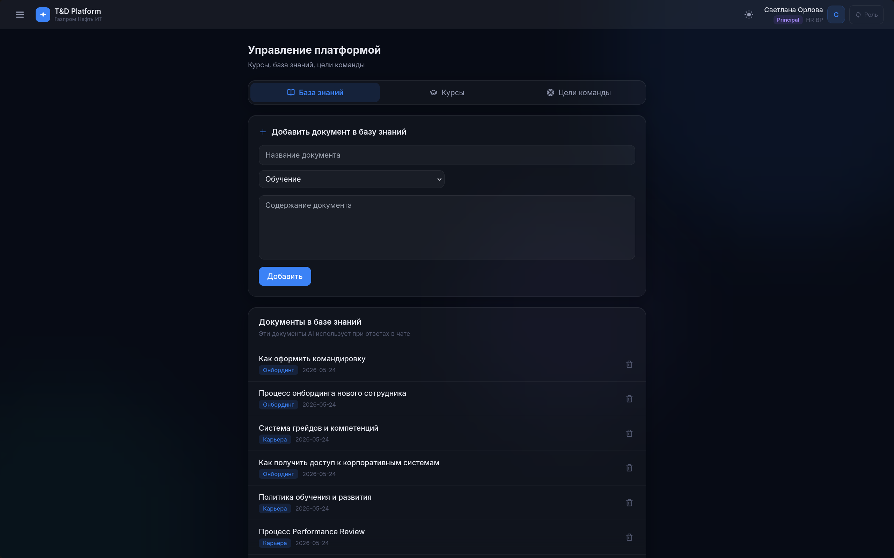
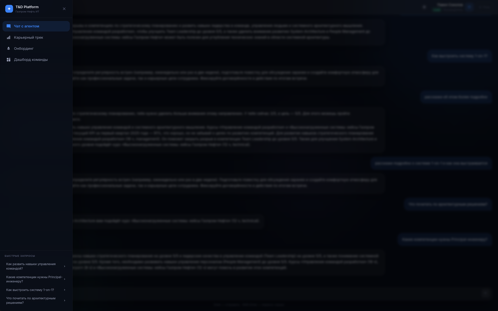

# T&D AI Platform — Корпоративная экосистема обучения и развития

Демо-прототип системы на базе AI-агентов для ИТ-кластера Газпром Нефти (кейс-чемпионат HSCC). Сотрудник задаёт вопрос в чате — оркестратор определяет намерение, подключает нужных агентов, ответ стримится в реальном времени.

---

## Скриншоты

<p align="center">
  
</p>

<p align="center">
  
  &nbsp;
  
  &nbsp;
  
</p>

<p align="center">
  
  &nbsp;
  
</p>

---

## Как это работает

Сотрудник пишет что-то вроде:
> «Хочу стать тимлидом через год, что мне нужно прокачать?»

Система делает следующее:

1. **Оркестратор** классифицирует запрос через LLM и понимает, что нужны два агента — карьеры и обучения
2. **Агент карьеры** смотрит текущий грейд, KPI, компетенции сотрудника
3. **Агент обучения** подбирает конкретные курсы из каталога под выявленные пробелы
4. Оба ответа стримятся в чат через SSE, история диалога сохраняется между сессиями

Интерфейс **адаптируется под профиль**: при переключении роли меняются быстрые запросы в сайдбаре, шаги онбординга и карьерный трек.

---

## Агенты

| Агент | Задача | Источники данных |
|---|---|---|
| **Оркестратор** | Классифицирует запрос через LLM, роутит к агентам | — |
| **Агент карьеры** | Анализирует грейд, KPI, строит карьерный трек | `employees`, `kpi_records`, `competencies` |
| **Агент обучения** | Подбирает курсы, строит траекторию | `courses`, `learning_progress` |
| **Агент онбординга** | Отвечает на вопросы по политикам и процессам | `knowledge_documents` (FTS5 RAG) |
| **Агент 1-on-1** | Генерирует структурированный бриф для встречи менеджера с сотрудником | `employees`, `kpi_records`, `competencies`, `learning_progress` |

Классификация запроса — один быстрый LLM-вызов (~200 мс): `career`, `learning`, `onboarding` или `mixed`. При `mixed` запускаются агент карьеры и агент обучения последовательно.

---

## Подготовка к 1-on-1

Менеджер нажимает **«Подготовиться»** рядом с сотрудником на дашборде — система за ~10 секунд генерирует структурированный бриф на основе реальных данных из БД:

```
ЧТО ВЫРОСЛО      — динамика KPI за последние периоды
ЧТО БЕСПОКОИТ    — компетенции с gap ≥ 2 и зависшие курсы (прогресс < 50%)
ВОПРОСЫ          — 3 живых вопроса под конкретный профиль
ПРЕДЛАГАЕМЫЕ ЦЕЛИ — 2 цели с дедлайном +30 дней
```

Бриф стримится в модальное окно, можно скопировать одной кнопкой. Эндпоинт: `POST /manager/one-on-one-prep`.

---

## Профили

В системе три демо-профиля. Переключение — кнопка **«Сменить роль»** в правом верхнем углу (циклически):

| Профиль | Роль | Доступные разделы |
|---|---|---|
| Иван Петров (Senior) | Сотрудник | Чат с агентом, Карьерный трек, Онбординг |
| Павел Соколов (Lead) | Руководитель | + Дашборд команды |
| Светлана Орлова (Principal) | HR BP | + Управление платформой |

### Управление платформой (HR BP)

Раздел доступен только профилю HR BP и позволяет управлять контентом в реальном времени:

- **База знаний** — загрузить текстовый документ. AI-агенты начинают использовать его в ответах сразу после добавления (через FTS5 RAG).
- **Курсы** — добавить новый курс в каталог, назначить его конкретному сотруднику.
- **Цели команды** — изменить целевые уровни компетенций для сотрудников, пересчитать разрывы (gap).

---

## Стек

| Слой | Технологии |
|---|---|
| LLM | Ollama (локально, приоритет) → Groq API (запасной) |
| Бэкенд | Python 3.11+, FastAPI, LangChain, aiosqlite |
| RAG | SQLite FTS5 (без эмбеддингов, полнотекстовый поиск) |
| Фронтенд | Next.js 14, React 18, TypeScript, Tailwind CSS |
| Стриминг | SSE (Server-Sent Events) |
| БД | SQLite |
| Контейнеризация | Docker, Docker Compose |

---

## Запуск локально

### Требования

- Python **3.11+** → [python.org](https://www.python.org/downloads/)
- Node.js **18+** → [nodejs.org](https://nodejs.org/)
- Ollama (опционально, но рекомендуется) → [ollama.com/download](https://ollama.com/download)

### Одной командой

```bash
python start.py
```

Скрипт делает всё автоматически:

- Если **Ollama установлен** — запускает `ollama serve`, скачивает модель если нужно, выставляет `USE_OLLAMA=true`
- Если **Ollama не установлен** — падает на Groq, требует `GROQ_API_KEY` в `backend/.env`
- Создаёт venv, ставит зависимости, поднимает бэкенд и фронтенд параллельно

Логи выводятся с цветными префиксами `[ollama]` / `[backend]` / `[frontend]`. Остановка — Ctrl+C: скрипт убивает все дочерние процессы целиком, порты 8000 и 3000 освобождаются гарантированно.

| | URL |
|---|---|
| Приложение | http://localhost:3000 |
| API / Swagger | http://localhost:8000/docs |

### Groq как запасной вариант

Если Ollama не установлен или недоступен, нужен ключ Groq:

```bash
cp backend/.env.example backend/.env
# вписать GROQ_API_KEY в backend/.env
```

Ключ бесплатно: [console.groq.com](https://console.groq.com).

Если оба провайдера настроены — Ollama всегда в приоритете. При падении Ollama во время работы бэкенд автоматически переключается на Groq без перезапуска.

---

## Запуск через Docker

```bash
cp backend/.env.example backend/.env   # вписать GROQ_API_KEY
docker compose up --build              # первый запуск (~3–5 мин)
docker compose up                      # последующие запуски
docker compose down -v                 # остановить + сбросить БД
```

> В Docker используется только Groq (Ollama внутри контейнера не поддерживается).

---

## Переменные окружения

**`backend/.env`** (создать из `.env.example`):

```env
GROQ_API_KEY=your_groq_api_key_here
GROQ_MODEL=llama-3.3-70b-versatile

DATABASE_URL=./db/td_demo.db
CORS_ORIGINS=http://localhost:3000
SEED_DB=true
DEBUG=false

# start.py выставляет автоматически по результату проверки Ollama
USE_OLLAMA=true
OLLAMA_BASE_URL=http://localhost:11434
OLLAMA_MODEL=yandex/YandexGPT-5-Lite-8B-instruct-GGUF:latest
```

**`frontend/.env.local`** (опционально):

```env
NEXT_PUBLIC_API_URL=http://localhost:8000
NEXT_PUBLIC_USE_MOCK=false   # true — работает без бэкенда, данные из mock/employee.ts
NEXT_PUBLIC_DEMO_EMPLOYEE_ID=emp_001
NEXT_PUBLIC_DEMO_MANAGER_ID=mgr_001
NEXT_PUBLIC_DEMO_ADMIN_ID=hr_001
```

---

## Локальные модели

`start.py` автоматически скачивает `yandex/YandexGPT-5-Lite-8B-instruct-GGUF:latest` при первом запуске. Модель можно сменить через `OLLAMA_MODEL` в `backend/.env`.

**Рекомендуемые русскоязычные модели:**

| Модель | Размер | Особенности |
|---|---|---|
| `yandex/YandexGPT-5-Lite-8B-instruct-GGUF:latest` | ~8 GB | Быстрая, хороший русский — **дефолт** |
| `Elephanterus/T-lite-it-1.0:7.6B-Q8_0` | ~8 GB | T-Lite от Т-банка |
| `t-tech/T-pro-it-2.0:q4_K_M` | ~20 GB | T-Pro, выше качество, нужно ≥ 24 GB RAM |

Минимальные требования для дефолтной модели: **12 GB RAM**.

---

## Частые проблемы

**Порт 3000 или 8000 занят** — если остался зависший процесс от предыдущего запуска:
```bash
fuser -k 8000/tcp 3000/tcp
```
При штатном Ctrl+C `start.py` освобождает порты автоматически. В Docker — поменять маппинг в `docker-compose.yml`:
```yaml
ports:
  - "3001:3000"
```

**Фронтенд не достучаться до бэкенда** — `NEXT_PUBLIC_API_URL` вшивается при сборке Docker-образа:
```bash
docker compose build --build-arg NEXT_PUBLIC_API_URL=http://your-host:8000 frontend
```

**Сбросить базу данных:**
```bash
docker compose down -v && docker compose up
# или локально: удалить backend/db/td_demo.db, перезапустить бэкенд
```

> Данные, добавленные через раздел «Управление» (курсы, документы), сбрасываются при перезапуске бэкенда — `SEED_DB=true` перезаписывает БД через `INSERT OR IGNORE`.

---

## Структура проекта

```
├── backend/
│   ├── agents/          # orchestrator, career_agent, learning_agent, onboarding_agent, one_on_one_agent, reviewer
│   ├── core/            # config (pydantic-settings + get_llm с fallback), database, seed_data
│   ├── db/              # schema.sql, td_demo.db (создаётся при старте)
│   ├── rag/             # retriever.py — FTS5 поиск по knowledge_fts
│   ├── routers/         # chat, employees, career, courses, dashboard, admin, manager
│   └── main.py
├── frontend/
│   └── src/
│       ├── app/         # /chat, /career, /onboarding, /dashboard, /admin
│       ├── components/  # layout, chat, career, dashboard (включая OneOnOneModal)
│       ├── context/     # ProfileContext.tsx — глобальный state профиля (3 роли)
│       ├── hooks/       # useStream.ts — SSE-клиент с историей
│       ├── lib/         # api.ts, types.ts
│       └── mock/        # employee.ts — данные для режима без бэкенда
├── start.py             # кросс-платформенный лаунчер с автозапуском Ollama
└── docker-compose.yml
```
